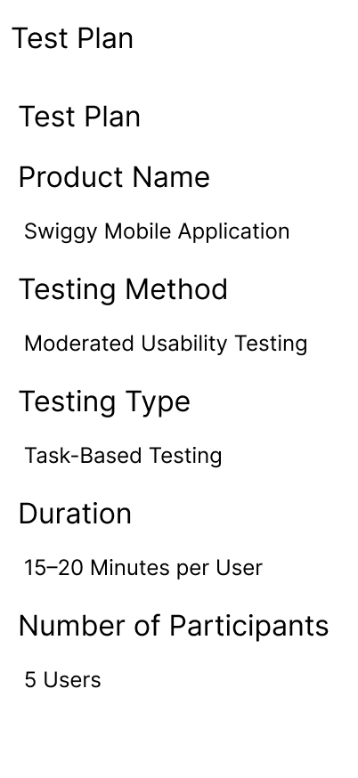
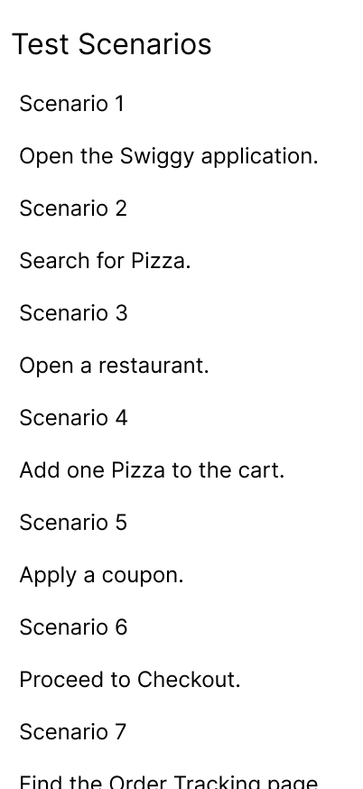
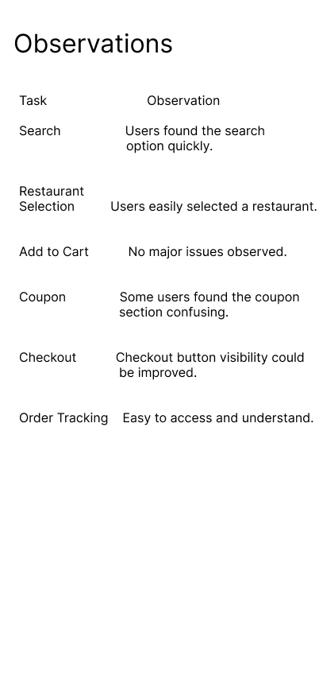
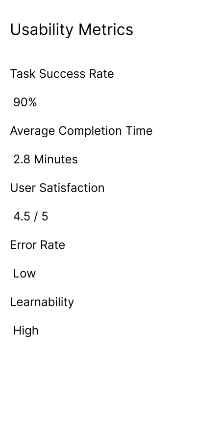
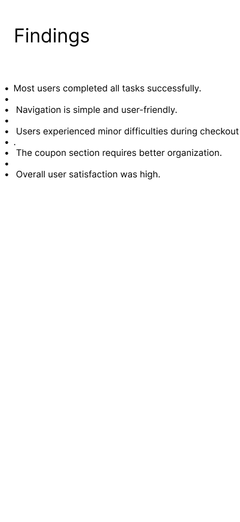
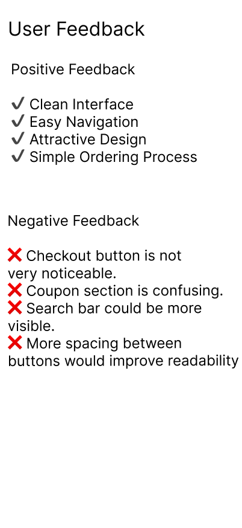
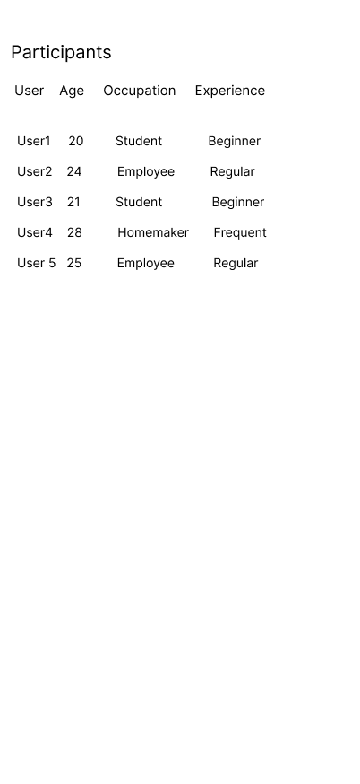
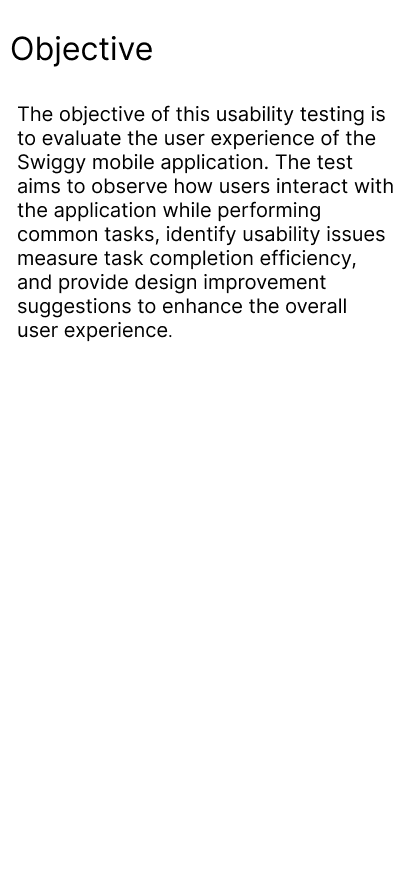
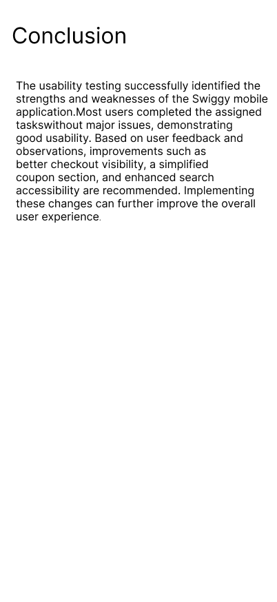
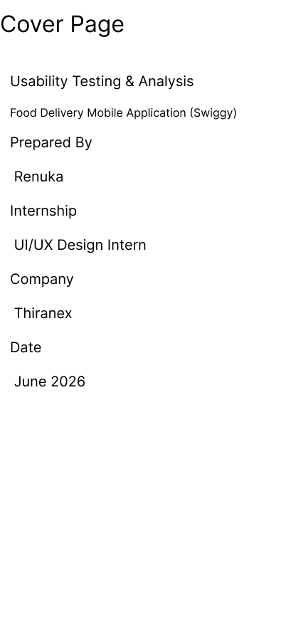

# 🧪 Usability Testing & Analysis

## 📌 Project Overview

This project focuses on conducting **Usability Testing and Analysis** for a food delivery mobile application. The purpose of the project is to evaluate the application's ease of use, understand user behavior, identify usability issues, collect feedback, and recommend improvements.

The testing process includes creating a test plan, defining test scenarios, observing users while they perform tasks, analyzing findings, and evaluating usability metrics.

---

## 🎯 Objective

The main objective of this project is to evaluate the usability of a **food delivery mobile application** by observing users while they complete common tasks.

The study focuses on:

* Identifying usability issues
* Understanding user behavior
* Measuring task success
* Evaluating user satisfaction
* Identifying areas for improvement
* Providing design recommendations

---

## 🛠️ Tools Used

* **Figma**
* **User Observation**
* **Usability Testing**
* **UI/UX Design Principles**

---

## 👥 Participants

The usability testing was conducted with:

* **5 Sample Users**
* Students and Working Professionals
* Users with different levels of experience with food delivery applications

---

## 📝 Test Plan

The usability testing was planned to evaluate how easily users could complete important tasks within the food delivery application.

The testing process included:

1. Preparing the test plan
2. Selecting participants
3. Defining test scenarios
4. Observing user interactions
5. Recording user feedback
6. Analyzing usability issues
7. Preparing recommendations

---

## 📸 Test Plan



---

## ✅ Test Scenarios

Users were asked to complete the following tasks:

1. Open the application
2. Search for a restaurant
3. View menu items
4. Add food to the cart
5. Apply a coupon
6. Proceed to checkout
7. Track the order

---

## 📸 Test Scenarios



---

## 👀 User Observations

During the testing process, users were observed while completing the assigned tasks.

The observations focused on:

* Navigation behavior
* User interactions
* Task completion
* Errors and difficulties
* Time taken to complete tasks
* User reactions
* Overall experience

---

## 📸 Observations



---

## 📊 Usability Metrics

The following usability metrics were considered:

| Metric                      | Description                                             |
| --------------------------- | ------------------------------------------------------- |
| **Task Success Rate**       | Percentage of users who successfully completed the task |
| **Average Completion Time** | Average time taken by users to complete a task          |
| **User Satisfaction**       | Users' overall satisfaction with the application        |
| **Error Rate**              | Number of errors made during task completion            |
| **Learnability**            | How easily users understand and learn the interface     |

---

## 📈 Usability Metrics



---

## 🔍 Key Findings

The usability testing produced the following findings:

* Most users successfully completed the assigned tasks.
* Navigation was simple and easy to understand.
* Some users found the coupon section confusing.
* The checkout button could be made more visible.
* Overall user satisfaction was high.

---

## 📸 Findings



---

## 💬 User Feedback

User feedback was collected after completing the assigned tasks.

The feedback helped identify areas where the interface could be improved and provided useful insights into the overall user experience.

---

## 📸 User Feedback



---

## 👥 Participants

The participants represented different types of users, including students and working professionals.

This helped provide different perspectives on the usability of the food delivery application.

---

## 📸 Participants



---

## 🎯 Objective

The project was focused on understanding how users interact with the food delivery application and identifying opportunities to improve the overall user experience.

---

## 📸 Objective



---

## 📖 Project Overview

The project follows a user-centered approach where actual user interactions and feedback are used to understand usability problems.

The complete process includes:

```text
Planning
   ↓
Participant Selection
   ↓
Test Scenarios
   ↓
User Testing
   ↓
Observation
   ↓
Feedback Collection
   ↓
Usability Analysis
   ↓
Findings
   ↓
Recommendations
```

---

## 🎉 Conclusion

The usability testing provided valuable insights into the user experience of the food delivery application.

The study helped identify usability issues related to navigation, coupon usage, and checkout visibility. These findings can be used to make the interface more intuitive, efficient, and user-friendly.

---

## 📸 Conclusion



---

## 📈 Outcome

This project improved my understanding of:

* Usability Testing
* User Behavior Analysis
* UX Research
* Usability Metrics
* User Feedback Analysis
* Identifying UX Problems
* Design Recommendations
* Iterative Design Improvement

It also strengthened my skills in conducting usability tests, documenting findings, and presenting results as a professional UI/UX case study.

---

## 📂 Repository Structure

```text
Usability-Testing-Analysis/
│
├── README.md
├── cover.png
├── objective.png
├── participants.png
├── test-plan.png
├── test-scenarios.png
├── observations.png
├── findings.png
├── usability-metrics.png
├── user-feedback.png
└── conclusion.png
```

---

# 🖼️ Complete Project Screenshots

### Cover



### Objective


### Participants


### Test Plan


### Test Scenarios


### Observations


### Findings


### Usability Metrics


### User Feedback


### Conclusion


---

## 👨‍💻 Created By

### Ajay Reddy Eguturi

**UI/UX Design | Usability Testing | UX Research**

---

⭐ If you found this project useful, feel free to explore the repository.
